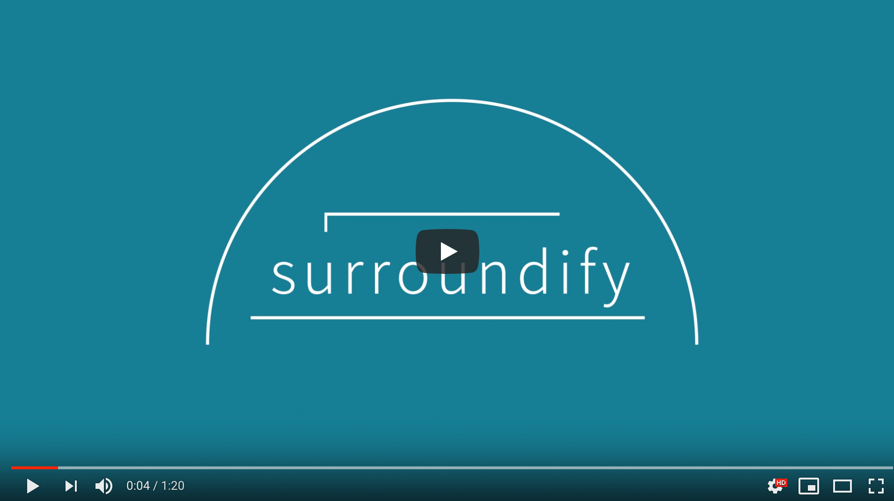

# ドーム型枕 surroundify

## 製品概要
### 安眠 × Tech

### 背景（製品開発のきっかけ、課題等）
- 寝ながら音楽を聞いたり、動画を見たりするとき、イヤホンをつけると首に絡まったり耳が痛くなったりする。しかし、枕元のスピーカーだけでは、臨場感あるステレオオーディオの魅力を十分に表現することが出来ない。
- 寝ながら音楽を聞くことに悩む全ての人に「surroundify」という提案を届けたい。

### 製品説明（具体的な製品の説明）
### 概要
ドーム型の枕とサラウンドスピーカーを組み合わせた安眠のためのデバイスです。

### 特長

#### 1. ドーム型枕で良質な眠りを
心地よく眠れない。音楽を聴きながら眠りたい。そんなあなたにこのドーム型枕。これを使うことで遮光、適度な閉塞感を実現し、落ち着いて音楽を聴きながら眠ることができます。
#### 2. 寝返り検知で音の向きを自動調整。最適なサラウンド環境を実現
ドーム上部に設置されたカメラで顔の向きを検出。耳のを計算し常に各チャンネルのスピーカーの音量を最適に調整することで、寝返りをうっても正しい向きでの臨場感あるサラウンド環境を実現します。
#### 3. シンプルな操作
操作は簡単。アプリ上で音声ファイルを指定するだけで枕から音声が再生されます。

### 解決出来ること
- 音楽を聴きながら気持ちよく眠れない
- 寝ホンの煩雑さ
- 寝ホン購入スパイラルからの脱却

### 今後の展望  
- Webカメラではなく感圧板などの別モジュールから姿勢を判定し、より高精度の顔向き検知を行う
- ドーム型デバイスの見た目と品質のブラッシュアップ
- Bluetoothでの接続と再生に対応する
- プログラムの実行環境をRaspberry Piなどの小型基板に移行する

## 開発内容・開発技術
### 活用した技術

[行列計算による顔の位置からの耳の角度検出方法](choice_speaker_by_mathmatic.pdf)

#### フレームワーク・ライブラリ・モジュール

- Python
- Processing

主要なライブラリ

* OpenCV
* dlib
* imutils
* audioop
* pyaudio
* wave
* [その他のライブラリ](https://github.com/jphacks/TK_1804/blob/master/requirements.txt)

#### デバイス

* ベビーカー
* 枕
* ステレオスピーカー 3セット
* オーディオインターフェース
* 赤外線Webカメラ

### 研究内容・事前開発プロダクト（任意）

ご自身やチームの研究内容や、事前に持ち込みをしたプロダクトがある場合は、こちらに実績なども含め記載をして下さい。

* アイデア出し
* デバイスの収集
* 顔検知システム・音声ストリーミング方法の調査
* カメラのキャリブレーション

### 独自開発技術（Hack Dayで開発したもの）
#### 2日間に開発した独自の機能・技術

* デバイスの組立て・追加購入
* 深層学習モデルによる顔・顔の傾きの検知
* 顔の傾きから耳の位置の検出
* [耳の位置を元に音声出力の調整](choice_speaker_by_mathmatic.pdf)
* GUIの作成

#### 特に力を入れた場所
https://github.com/jphacks/TK_1804/blob/master/src/process.py

* 顔検出による耳の角度推定、それに基づく音声出力の調整を非同期処理によって実現した
    

